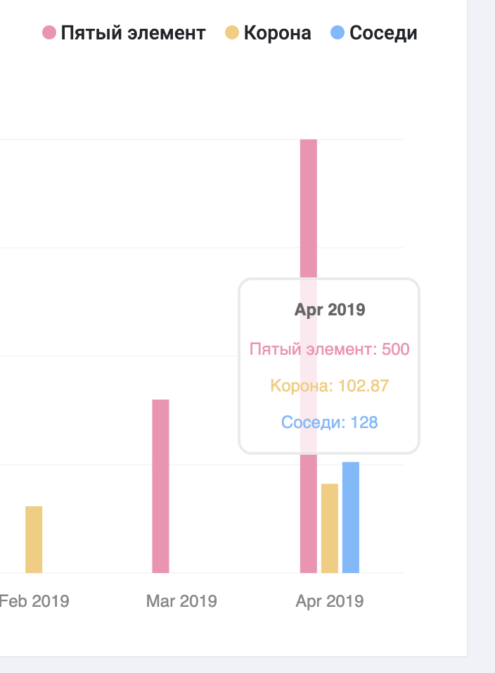
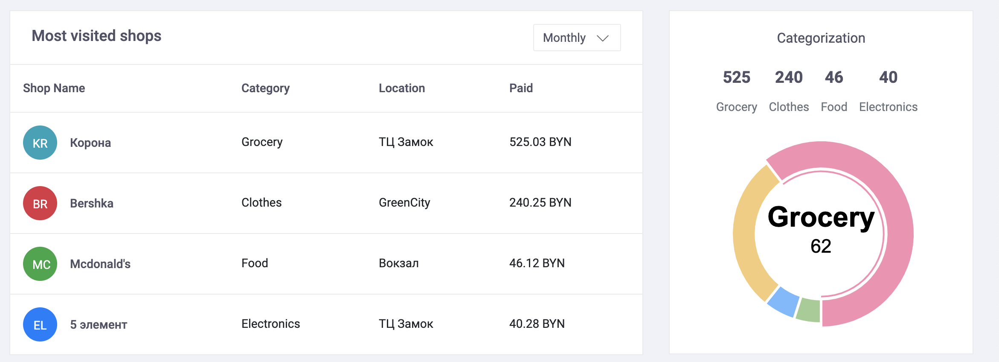
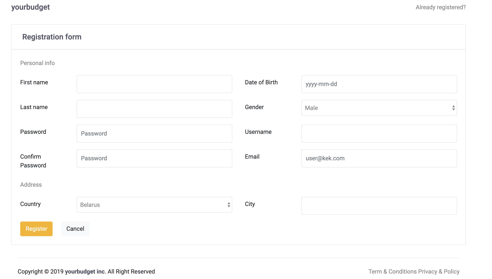

# yourbudget

### твой финансовый помощник

#### Основной интерфейс приложения: 

- пространство по центру занято различной статистикой пользователя. Четыре показателя сверху имеют ползунок, который накапливается по мере достижения некоторой цели.

- на график Budget Overview автоматически определяются три любимых магазина пользователя, после чего строится статистика затрат за последние полгода.

- три ползунка справа показывают изменение некоторых показателей относительно предыдущего месяца.

- таблица Most visited shops позволяет посмотреть несколько самых часто посещаемых магазина за выбранный период времени.

- диаграмма Categorization группирует расходы по категориям.

#### Прежде чем попасть на сайт:

1. Форма регистрации. Требует некоторую информацию от пользователя. При правильно введенной информации регистрирует пользователя. После чего, выполняется переход на страницу авторизации.

2. Страница авторизации. 

